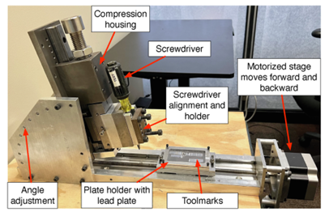
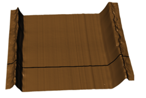

# Detecting Dust Particles

This is a small study mainly circles around the main objective, **"Identify the dust particles on the scans obtained to evaluate the striation patterns obtained by running (either pulling or pushing) screw drivers (flat headed) with various angles (60, 70, 80) using both sides (A, B) on lead plates"**

{fig-align="center" width="333" height="219"}

Here we are ignoring the experiment totally that collected the data and solely focus on detecting the coordinates of dust particles. And, these images are high resolution images and scales are also very small (basically in nano meters). We can use the graphs (scatter-plots) drawn for `nearby` **(lags)** cross sections (both vertical and horizontal) to identify the existing dust particles using the property of the uniformity of the nearby vertical and horizontal cross-sections . but that is tedious task. Notice that according to the @fig-horizontal-cross-section it can be clearly observable to a naked eye that the surface is pretty much uniform.

And initially i believed by using a classification technique, we can easily detect the peaks in the image by simply training a suitable ML algorithm. But, due to the fact that the images are taken at very small scales, it was not easy to come up with a threshold that ables to recognize the peaks by examining the transformed data using the `x3p_to_df` function which gives x and y coordinates with a value assigned to each an every pixel coordinate.

{#fig-horizontal-cross-section fig-align="center"}

Hence, it is vital to use focal maps. So we will be using an appropriate focal matrix `(Spacial Data analysis)` in order to find these peaks in the scanned images, rather than the previous approach. For the analysis, we will be using `"terra"` package.

## Objectives of this study:

-   Identify the location of the peaks where the dust particles are located.

-   Identify the locations around the peaks with in a certain radius to detect the size of the dust particle in pixels.

## Tasks to do

1.  install git-lfs `(done)`

2.  get familiar with working with x3p formatted data. (Just for one gel type)

    i.  Horizontal surfaces

    ii. vertical surfaces

3.  find a suitable a focal matrix to work with these image data.

4.  get familiar to working with raster data.

5.  Later extend this to other gels.

## June 11 - 18

I was able to clear most of my doubts regarding the project. So I started working with the scans (obtained through a particular gel), which I was provided with. Since all the images were with higher resolution, the file sizes were quite big. Hence, I had to install `git lfs` that helps tracking down `.x3p` files in my data.

-   I am still learning about the spacial data handling with `terra`.

-   I got a bit familiar with working with x3p formatted data. (Just for one gel type)

    -   Horizontal surfaces (horizontal cross sections)

    -   Vertical surfaces (vertical cross sections)

-   Also in the process of reviewing R materials.
